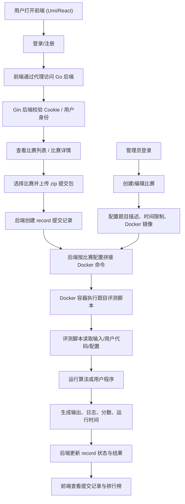

# compcub

本仓库目前包含两个主要项目：

- `CPN/`
  计算平台后端，使用 Go + Gin + MongoDB。
- `ithings-new-main/`
  计算平台前端，使用 Umi Max + React + Ant Design。

这份文档按“第一次接触这个项目、从零开始运行”的角度来写。你可以直接从头照着做。

## 1. 项目结构

```text
E:\study\EXERCISE
├─ CPN                 # 后端
├─ ithings-new-main    # 前端
└─ README.md           # 当前说明文档
```

## 2. 当前默认端口

- 前端开发端口：`8000`
- 后端服务端口：`8001`

前端已经配置了开发代理，请求会从前端自动转发到后端。

## 3. 运行前你需要准备什么

### 3.1 前端环境

建议安装：

- Node.js `18.x` 或 `20.x`
- npm

检查方式：

```powershell
node -v
npm -v
```

### 3.2 后端环境

建议安装：

- Go `1.21+`
- MongoDB

检查方式：

```powershell
go version
mongod --version
```

如果你没有 MongoDB，也可以先尝试运行后端。当前代码里加了一个“开发兜底模式”：

- 当后端连不上 MongoDB 时，会自动切换到内存数据
- 这样你至少可以先把登录、比赛列表、记录列表这些页面跑起来

注意：

- 内存数据只适合本地调试
- 重启后数据不会保留
- 如果你要做真实开发，还是建议连上 MongoDB

## 4. 第一次运行的推荐顺序

建议严格按下面顺序来：

1. 先启动后端
2. 确认后端端口正常
3. 再启动前端
4. 打开浏览器测试登录

## 5. 后端运行方法

### 5.1 检查后端配置文件

后端配置文件在：

`CPN/config/config.yaml`

当前关键配置如下：

- 监听地址：`0.0.0.0`
- 端口：`8001`
- Mongo 用户名：`admin`
- Mongo 密码：`1234asdF`

如果你们组里有统一 MongoDB 服务器，请把下面这个字段改成实际地址：

```yaml
database:
  host: mongodb://localhost:27017
```

如果你本机自己装了 MongoDB，一般先保持这个默认值即可。

### 5.2 启动 MongoDB

如果你本机有 MongoDB，先启动它。

常见方式之一：

```powershell
mongod --dbpath D:\mongodb-data
```

如果你的 MongoDB 是作为 Windows 服务安装的，也可以在“服务”里启动它。

### 5.3 启动后端

进入后端目录：

```powershell
cd E:\study\EXERCISE\CPN
```

推荐方式一，直接运行：

```powershell
go run main.go
```

推荐方式二，如果你使用 GoLand：

1. 用 GoLand 打开 `E:\study\EXERCISE\CPN`
2. 找到 `main.go`
3. 右键 `Run 'main.go'`

### 5.4 如何判断后端启动成功

启动成功后，你应该看到类似“监听端口”或 Gin 路由输出。

也可以手动访问：

[http://127.0.0.1:8001/](http://127.0.0.1:8001/)

如果后端正常，应该返回一段 JSON。

### 5.5 后端接口文档

项目中带有 Swagger 相关文件，接口文档入口通常是：

[http://127.0.0.1:8001/docs/index.html](http://127.0.0.1:8001/docs/index.html)

如果打不开，可能是：

- 后端没启动成功
- 当前 Go 依赖没装完整
- 本机环境和原始开发环境不一致

## 6. 前端运行方法

### 6.1 安装依赖

进入前端目录：

```powershell
cd E:\study\EXERCISE\ithings-new-main
```

安装依赖：

```powershell
npm install
```

如果你之前已经装过，可以跳过这一步。

### 6.2 启动前端开发服务

推荐使用：

```powershell
npm run start:no-ui
```

如果你更习惯常规开发模式，也可以：

```powershell
npm run start:dev
```

### 6.3 如何判断前端启动成功

正常情况下，Umi 会输出本地访问地址，默认是：

[http://127.0.0.1:8000](http://127.0.0.1:8000)

浏览器打开后应该能进入登录页。

## 7. 首次登录怎么进系统

如果后端没有连上 Mongo，而是走开发兜底模式，可以直接使用默认账号：

- 用户名：`administrator`
- 密码：`iThings666`

---

## 项目介绍

这个仓库是一个“算法竞赛/算力调度实验平台”。

- `CPN/` 是后端平台，负责用户登录、比赛管理、提交记录、排行榜、文件目录和 Docker 调度。
- `ithings-new-main/` 是前端界面，负责登录、查看比赛、上传代码、查看提交记录和管理员页面。
- `CPN/dockerfile/` 下放的是具体题目或算法实验脚本，平台本身不直接实现算法，而是通过 Docker 镜像执行不同比赛题目的评测逻辑。

平台的核心目标不是做通用 IoT 管理，而是提供一个本地可联调的“在线评测 + 算法实验”环境：

- 用户可以注册、登录、查看比赛题目。
- 用户可以上传 `.zip` 代码包参与比赛。
- 后端会把提交记录保存下来，并通过 Docker 执行对应题目的评测镜像。
- 评测完成后，系统会回写分数、运行时间、错误信息和排行榜。

### 算法与实验特点

从 `CPN/dockerfile/` 目录看，这个项目当前聚焦的是多数据中心/多虚拟机资源调度与任务卸载问题，重点关注：

- SLA 约束
- 时间成本
- 能耗成本
- 资源分配
- 队列稳定性

仓库中可以看到的典型算法/实验脚本包括：

- `LyDROO`
- `A2SC`
- `MemoryDNN`
- `ResourceAllocation_3_queue`

这些脚本通常会在不同参数下反复仿真，统计价格、数据队列、时间队列、能耗队列等指标，并输出结果用于画图或论文分析。

## 业务流程图



## 当前平台最小联调链路

目前仓库已经整理成适合本地联调的最小链路：

1. 启动后端 `CPN`
2. 启动前端 `ithings-new-main`
3. 使用 `administrator / iThings666` 登录
4. 查看比赛列表
5. 进入比赛详情
6. 上传 `.zip` 代码
7. 查看提交记录与排行榜

## 当前对接说明

前端当前对接的是比赛平台接口，而不是旧的 `iThings` 大型接口集。当前主要使用的后端接口为：

- `POST /login`
- `POST /register`
- `GET /getInfo`
- `POST /logout`
- `GET/POST/PUT/DELETE /competition`
- `GET /record`
- `GET/POST /competition/:competitionID/record`
- `GET/POST/PUT/DELETE /user`

开发环境下，前端代理会将这些接口请求转发到 `http://127.0.0.1:8001`。

如果后端连接的是你自己的 MongoDB，并且数据库里没有用户：

1. 先去注册页注册一个账号
2. 再回登录页登录

## 8. 前后端联调关系

前端当前通过代理访问后端。

代理配置文件在：

`ithings-new-main/config/proxy.ts`

目前已配置为：

- 所有开发请求转发到 `http://127.0.0.1:8001`

这意味着：

- 你只需要启动前端和后端
- 不需要手动改接口前缀

## 9. 推荐的最小可运行测试流程

如果你只是想先确认“整套东西能不能动”，建议按下面测试：

1. 启动后端
2. 浏览器打开 [http://127.0.0.1:8001/](http://127.0.0.1:8001/)
3. 启动前端
4. 浏览器打开 [http://127.0.0.1:8000](http://127.0.0.1:8000)
5. 使用 `administrator / iThings666` 登录
6. 进入比赛列表页
7. 点击某个比赛查看详情
8. 查看记录列表页是否能正常加载

如果这 8 步都没问题，说明项目至少已经达到“本地可联调”的状态。

## 10. 常见问题排查

### 10.1 前端启动失败

先检查：

```powershell
node -v
npm -v
```

再尝试：

```powershell
cd E:\study\EXERCISE\ithings-new-main
npm install
npm run tsc
npm run build
```

如果 `npm run tsc` 和 `npm run build` 都过了，但 `start` 失败，通常是本机权限、端口占用或 Umi 环境问题。

### 10.2 后端启动失败

先检查：

```powershell
go version
```

然后看这几类问题：

- Go 依赖没有下载完成
- MongoDB 连不上
- 端口被占用
- 本机没有 Docker，但某些流程里触发了 Docker 相关逻辑

### 10.3 MongoDB 连不上

先确认：

- MongoDB 是否已启动
- `config.yaml` 里的 `host` 是否正确
- 用户名和密码是否正确

如果只是想先看页面，可以先不处理这个问题，让后端走内存兜底模式。

### 10.4 端口被占用

如果 `8000` 或 `8001` 被占用了，你可以改端口。

需要同步改的地方：

- 后端：`CPN/config/config.yaml`
- 前端代理：`ithings-new-main/config/proxy.ts`

### 10.5 登录成功但页面空白

通常先看这三点：

1. 后端 `/getInfo` 是否返回正常
2. 浏览器开发者工具 Network 里接口是否 200
3. 前端代理是不是转发到了正确端口

## 11. 如果你想编译部署到 Linux

在后端目录下执行：

```powershell
SET GOOS=linux
go build -o CPN_server
```

然后把生成的 `CPN_server` 上传到 Linux 服务器：

```bash
./CPN_server
```

注意：

- 这是文档里的推荐流程
- 实际部署前，你还需要确认 Mongo 地址、文件目录和 Docker 环境

## 12. 当前仓库状态说明

当前仓库已经做过一轮本地联调整理，重点包括：

- 前端已经精简到可以对接当前后端接口
- 前端构建已验证通过
- 后端配置已经按本地开发思路整理
- 后端增加了 Mongo 不可用时的开发兜底数据

如果你接下来准备继续开发，建议优先做这两件事：

1. 确认 MongoDB 的最终使用方案
2. 再逐步补全后端业务接口和前端页面细节

## 13. 你第一次运行时最推荐使用的命令

后端：

```powershell
cd E:\study\EXERCISE\CPN
go run main.go
```

前端：

```powershell
cd E:\study\EXERCISE\ithings-new-main
npm install
npm run start:no-ui
```

浏览器访问：

- 前端：[http://127.0.0.1:8000](http://127.0.0.1:8000)
- 后端健康入口：[http://127.0.0.1:8001/](http://127.0.0.1:8001/)

默认开发登录账号：

- 用户名：`administrator`
- 密码：`iThings666`
